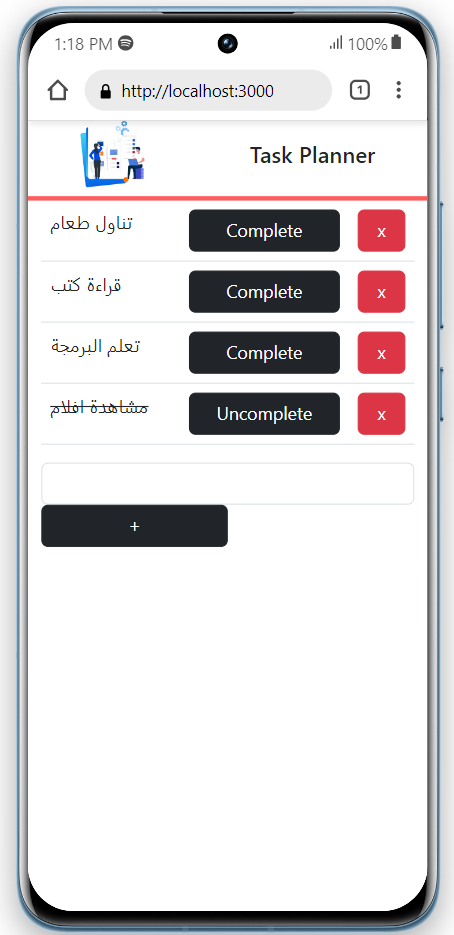
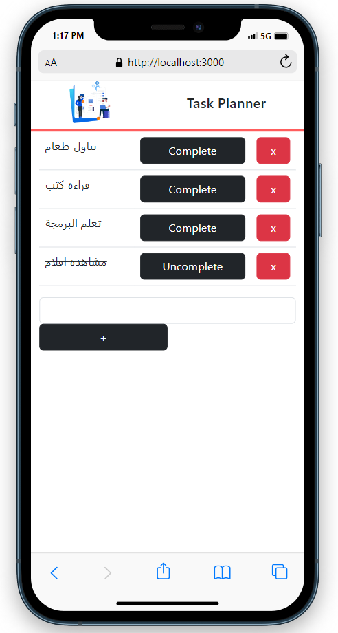
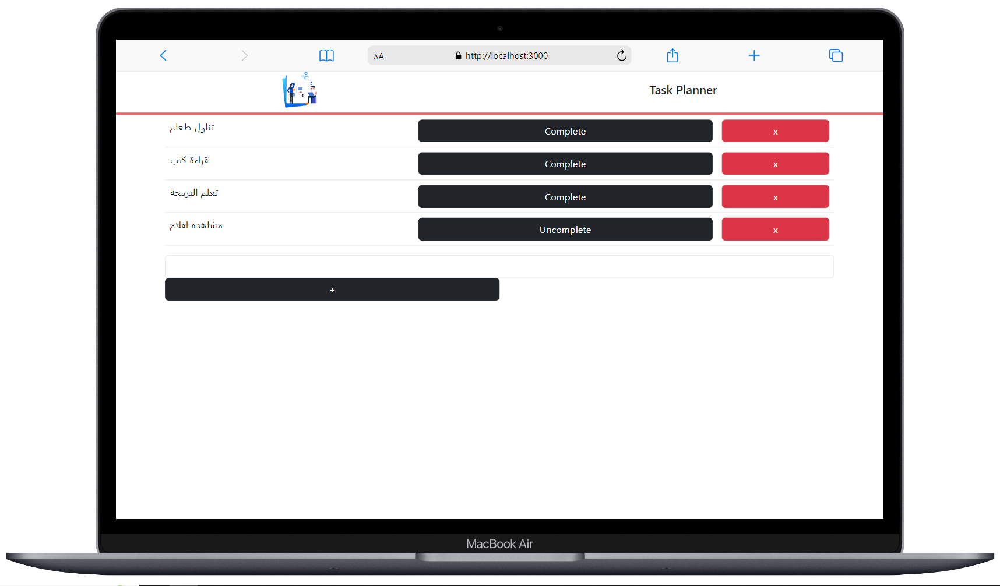

# Task Planner (Task Manager | To do project in React )

Task Planner is a simple and user-friendly web application that allows users to manage their tasks and to-do lists efficiently. With this intuitive tool, users can add new tasks, mark existing tasks as completed or incomplete, and remove tasks when they are finished. The application is built using React and leverages the useReducer, useState, and useEffect hooks to provide a seamless and interactive user experience.

## Key Features

- **Add Tasks**: Easily Users can add new tasks to their to-do list by entering the task name and clicking the '+' button, ensuring their task list stays up-to-date and organized.

- **Complete/Uncomplete Tasks**: With just one click, users can mark their tasks as completed or uncompleted, making it easy to track which tasks have been accomplished and which ones are still pending.

- **Remove Tasks**: Once a task is completed and no longer needed, users can easily remove it from their task list using the 'x' button.

- **Data Persistence**: Task Planner ensures that user tasks are not lost, even when they close their browsers, thanks to local storage. All tasks are securely stored, providing a seamless experience across sessions.

## Live Demo - العرض التجريبي المباشر

<table>
  <tr>
    <td style="text-align:center">
      
      
<em>عرض التجريبي على هاتف Android</em>

    </td>
    <td style="text-align:center">
      
      
<em>عرض التجريبي على هاتف iPhone</em>

    </td>
  </tr>
</table>

Check out the live demo of Task Planner [https://codershiyar.github.io/task-planner/](https://codershiyar.github.io/task-planner/).

## Usage

Simply visit the live demo link above to start using Task Planner. You can add, complete, and remove tasks from the interface easily.

Happy Task Planning! 🚀

# مخطط المهام

مخطط المهام هو تطبيق ويب بسيط وسهل الاستخدام يتيح للمستخدمين إدارة مهامهم وقوائم المهام بكفاءة. من خلال هذه الأداة البديهية، يمكن للمستخدمين إضافة مهام جديدة، ووضع علامة على المهام الحالية كمكتملة أو غير مكتملة، وحذف المهام عندما تكتمل. تم بناء التطبيق باستخدام تقنية React واستغلال خصائص الـ `useReducer` و `useState` و `useEffect` لتوفير تجربة مستخدم سلسة وتفاعلية.

## المميزات الرئيسية

- **إضافة المهام**: يمكن للمستخدمين بسهولة إضافة مهام جديدة إلى قائمة المهام الخاصة بهم عن طريق إدخال اسم المهمة والنقر فوق الزر '+'، مما يضمن تحديث وتنظيم قائمة المهام الخاصة بهم.

- **إتمام المهام/عدم إكمالها**: بنقرة واحدة فقط، يمكن للمستخدمين وضع علامة على المهام كمكتملة أو غير مكتملة، مما يسهل تتبع المهام التي تم إنجازها والمهام التي لا تزال قيد الانتظار.

- **حذف المهام**: بمجرد إتمام المهمة وعدم الحاجة إليها بعد الآن، يمكن للمستخدمين إزالتها بسهولة من قائمة المهام باستخدام الزر 'x'.

- **حفظ المهام**: مخطط المهام يضمن عدم فقدان مهام المستخدم حتى عند إغلاق المتصفح، وذلك بفضل استخدام التخزين المحلي (Local Storage). يتم تخزين جميع المهام بأمان، مما يوفر تجربة سلسة عبر الجلسات.

## العرض التجريبي المباشر

قم بزيارة الرابط التالي للاطلاع على العرض التجريبي المباشر لمخطط المهام: [هنا](https://codershiyar.github.io/task-planner/).

## كيفية الاستخدام

قم ببساطة بزيارة الرابط التجريبي المباشر أعلاه للبدء باستخدام مخطط المهام. يمكنك إضافة وإكمال وحذف المهام بسهولة من واجهة التطبيق.

نتمنى لك تجربة ممتعة في تنظيم مهامك! 🚀
